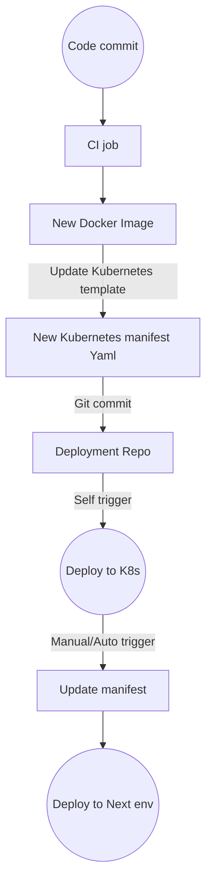

## CI

### Platforms
- Jenkins
- Gitlab CI
- Travis
- Buildkite

### Scaleable Jenkins architecture


- Use external storage plugin to host artifacts
- Store job/pipeline configurations in code repository
- Use Docker container for each stage, which means to need to install various dependencies on agents
- Scale up/down(On-demand) agents when needed to save costs.

### A sample jenkins job configuration file

From <https://github.com/GoogleCloudPlatform/continuous-deployment-on-kubernetes/blob/master/sample-app/Jenkinsfile>

```
pipeline {

  environment {
    PROJECT = "REPLACE_WITH_YOUR_PROJECT_ID"
    APP_NAME = "gceme"
    FE_SVC_NAME = "${APP_NAME}-frontend"
    CLUSTER = "jenkins-cd"
    CLUSTER_ZONE = "us-east1-d"
    IMAGE_TAG = "gcr.io/${PROJECT}/${APP_NAME}:${env.BRANCH_NAME}.${env.BUILD_NUMBER}"
    JENKINS_CRED = "${PROJECT}"
  }

  agent {
    kubernetes {
      label 'sample-app'
      defaultContainer 'jnlp'
      yaml """
apiVersion: v1
kind: Pod
metadata:
labels:
  component: ci
spec:
  # Use service account that can deploy to all namespaces
  serviceAccountName: cd-jenkins
  containers:
  - name: golang
    image: golang:1.10
    command:
    - cat
    tty: true
  - name: gcloud
    image: gcr.io/cloud-builders/gcloud
    command:
    - cat
    tty: true
  - name: kubectl
    image: gcr.io/cloud-builders/kubectl
    command:
    - cat
    tty: true
"""
}
  }
  stages {
    stage('Test') {
      steps {
        container('golang') {
          sh """
            ln -s `pwd` /go/src/sample-app
            cd /go/src/sample-app
            go test
          """
        }
      }
    }
    stage('Build and push image with Container Builder') {
      steps {
        container('gcloud') {
          sh "PYTHONUNBUFFERED=1 gcloud builds submit -t ${IMAGE_TAG} ."
        }
      }
    }
    stage('Deploy Canary') {
      // Canary branch
      when { branch 'canary' }
      steps {
        container('kubectl') {
          // Change deployed image in canary to the one we just built
          sh("sed -i.bak 's#gcr.io/cloud-solutions-images/gceme:1.0.0#${IMAGE_TAG}#' ./k8s/canary/*.yaml")
          step([$class: 'KubernetesEngineBuilder',namespace:'production', projectId: env.PROJECT, clusterName: env.CLUSTER, zone: env.CLUSTER_ZONE, manifestPattern: 'k8s/services', credentialsId: env.JENKINS_CRED, verifyDeployments: false])
          step([$class: 'KubernetesEngineBuilder',namespace:'production', projectId: env.PROJECT, clusterName: env.CLUSTER, zone: env.CLUSTER_ZONE, manifestPattern: 'k8s/canary', credentialsId: env.JENKINS_CRED, verifyDeployments: true])
          sh("echo http://`kubectl --namespace=production get service/${FE_SVC_NAME} -o jsonpath='{.status.loadBalancer.ingress[0].ip}'` > ${FE_SVC_NAME}")
        }
      }
    }
    stage('Deploy Production') {
      // Production branch
      when { branch 'master' }
      steps{
        container('kubectl') {
        // Change deployed image in canary to the one we just built
          sh("sed -i.bak 's#gcr.io/cloud-solutions-images/gceme:1.0.0#${IMAGE_TAG}#' ./k8s/production/*.yaml")
          step([$class: 'KubernetesEngineBuilder',namespace:'production', projectId: env.PROJECT, clusterName: env.CLUSTER, zone: env.CLUSTER_ZONE, manifestPattern: 'k8s/services', credentialsId: env.JENKINS_CRED, verifyDeployments: false])
          step([$class: 'KubernetesEngineBuilder',namespace:'production', projectId: env.PROJECT, clusterName: env.CLUSTER, zone: env.CLUSTER_ZONE, manifestPattern: 'k8s/production', credentialsId: env.JENKINS_CRED, verifyDeployments: true])
          sh("echo http://`kubectl --namespace=production get service/${FE_SVC_NAME} -o jsonpath='{.status.loadBalancer.ingress[0].ip}'` > ${FE_SVC_NAME}")
        }
      }
    }
    stage('Deploy Dev') {
      // Developer Branches
      when {
        not { branch 'master' }
        not { branch 'canary' }
      }
      steps {
        container('kubectl') {
          // Create namespace if it doesn't exist
          sh("kubectl get ns ${env.BRANCH_NAME} || kubectl create ns ${env.BRANCH_NAME}")
          // Don't use public load balancing for development branches
          sh("sed -i.bak 's#LoadBalancer#ClusterIP#' ./k8s/services/frontend.yaml")
          sh("sed -i.bak 's#gcr.io/cloud-solutions-images/gceme:1.0.0#${IMAGE_TAG}#' ./k8s/dev/*.yaml")
          step([$class: 'KubernetesEngineBuilder',namespace: "${env.BRANCH_NAME}", projectId: env.PROJECT, clusterName: env.CLUSTER, zone: env.CLUSTER_ZONE, manifestPattern: 'k8s/services', credentialsId: env.JENKINS_CRED, verifyDeployments: false])
          step([$class: 'KubernetesEngineBuilder',namespace: "${env.BRANCH_NAME}", projectId: env.PROJECT, clusterName: env.CLUSTER, zone: env.CLUSTER_ZONE, manifestPattern: 'k8s/dev', credentialsId: env.JENKINS_CRED, verifyDeployments: true])
          echo 'To access your environment run `kubectl proxy`'
          echo "Then access your service via http://localhost:8001/api/v1/proxy/namespaces/${env.BRANCH_NAME}/services/${FE_SVC_NAME}:80/"
        }
      }
    }
  }
}
```

## CD

### Tools Comparision


### An example CI/CD flow



### Spinnaker

Spinnaker is an open-source, multi-cloud continuous delivery platform that helps you release software changes with high velocity and confidence. Spinnaker provides two core sets of features:

	application management

	application deployment

## Everything is code

- Infrastructure as code
- CI config as code
- Dockerfile

## Automation tools

### Capistrano
A ruby tool for deploy applications
### Chef

#### What is chef

Chef enables you to manage and scale cloud infrastructure with no downtime or interruptions. Freely move applications and configurations from one cloud to another. Chef is integrated with all major cloud providers including Amazon EC2, VMWare, IBM Smartcloud, Rackspace, OpenStack, Windows Azure, HP Cloud, Google Compute Engine, Joyent Cloud and others.

Chef running a `chef-client` on each node to be a runner to install applications on remote server. The client can use both `pull` and `push` modes to to communication.

More:

- Chef vs ansible: <https://www.chef.io/ansible/>

### Ansible

#### What is Ansible
Ansible is an IT automation tool. It can configure systems, deploy software, and orchestrate more advanced IT tasks such as continuous deployments or zero downtime rolling updates. Ansible’s goals are foremost those of simplicity and maximum ease of use.

Ansible uses `SSH` to execute commands on remote server and use `RabbitMQ` at the transport level by `push` updates

### Puppet

Is also a configuration management tool for servers and designed to install and manage software on existing servers.

### Packer

Packer is a tool to allows you build a machine image which contains all preinstalled and configged applications.

### Terraform

#### What is Terraform
Terraform use a declarative language to describe the current state of infrastructure, and there is no server side agent installed.

Terraform is more about declare the resources/services requirements, rather than install softwares and libraries on remote server.


#### Basic steps
```bash
# go to the folder which stores the environment credentials
terraform init # Initialize a new or existing Terraform working directory by creating initial files, loading any remote state, downloading modules, etc.
terraform get # Downloads and installs modules that defined by configuration files
terraform plan # Kind of try run, you will what kind of changes you will have
terraform apply # Apply changes to cluster
```

## HA(High Availability)
- LB - haproxy
- Keepalived -- vrrp
	- Nginx + Keepalived
- Heartbeat

## Network
- IP
	- Private IP Addresses
		- 10.0.0.0 – 10.255.255.255
		- 172.16.0.0 – 172.31.255.255
		- 192.168.0.0 – 192.168.255.255

### OSI Model( 7 layers network)


### CIDR blocks

[Wikipedia](https://en.wikipedia.org/wiki/Classless_Inter-Domain_Routing)

|**Address**|**Difference**|**Mask**|**Addresses**|**2n**|**Relative**|**Restrictions**|**Typical use**|
| :----:|:---:|:---:|:---:|:---:|:---:|:---:|:---:|
|a.b.c.d/32|+0.0.0.0|255.255.255.255|1|20|​1⁄256 C| |Host route
|a.b.c.d/31|+0.0.0.1|255.255.255.254|2|21|​1⁄128 C|d = 0 ... (2n) ... 254|Point to point links (RFC 3021)
|a.b.c.d/30|+0.0.0.3|255.255.255.252|4|22|​1⁄64 C|d = 0 ... (4n) ... 252|Point to point links (glue network)
|a.b.c.d/29|+0.0.0.7|255.255.255.248|8|23|​1⁄32 C|d = 0 ... (8n) ... 248|Smallest multi-host network
|a.b.c.d/28|+0.0.0.15|255.255.255.240|16|24|​1⁄16 C|d = 0 ... (16n) ... 240|Small LAN
|a.b.c.d/27|+0.0.0.31|255.255.255.224|32|25|⅛ C|d = 0 ... (32n) ... 224|
|a.b.c.d/26|+0.0.0.63|255.255.255.192|64|26|¼ C|d = 0, 64, 128, 192|
|a.b.c.d/25|+0.0.0.127|255.255.255.128|128|27|½ C|d = 0, 128|Large LAN
|a.b.c.0/24|+0.0.0.255|255.255.255.0|256|28|1 C| |
|a.b.c.0/23|+0.0.1.255|255.255.254.0|512|29|2 C|c = 0 ... (2n) ... 254|
|a.b.c.0/22|+0.0.3.255|255.255.252.0|1,024|210|4 C|c = 0 ... (4n) ... 252|Small business
|a.b.c.0/21|+0.0.7.255|255.255.248.0|2,048|211|8 C|c = 0 ... (8n) ... 248|Small ISP/ large business
|a.b.c.0/20|+0.0.15.255|255.255.240.0|4,096|212|16 C|c = 0 ... (16n) ... 240|
|a.b.c.0/19|+0.0.31.255|255.255.224.0|8,192|213|32 C|c = 0 ... (32n) ... 224|ISP/ large business
|a.b.c.0/18|+0.0.63.255|255.255.192.0|16,384|214|64 C|c = 0, 64, 128, 192|
|a.b.c.0/17|+0.0.127.255|255.255.128.0|32,768|215|128 C|c = 0, 128|
|a.b.0.0/16|+0.0.255.255|255.255.0.0|65,536|216|256 C = B| |
|a.b.0.0/15|+0.1.255.255|255.254.0.0|131,072|217|2 B|b = 0 ... (2n) ... 254|
|a.b.0.0/14|+0.3.255.255|255.252.0.0|262,144|218|4 B|b = 0 ... (4n) ... 252|
|a.b.0.0/13|+0.7.255.255|255.248.0.0|524,288|219|8 B|b = 0 ... (8n) ... 248|
|a.b.0.0/12|+0.15.255.255|255.240.0.0|1,048,576|220|16 B|b = 0 ... (16n) ... 240|
|a.b.0.0/11|+0.31.255.255|255.224.0.0|2,097,152|221|32 B|b = 0 ... (32n) ... 224|
|a.b.0.0/10|+0.63.255.255|255.192.0.0|4,194,304|222|64 B|b = 0, 64, 128, 192|
|a.b.0.0/9|+0.127.255.255|255.128.0.0|8,388,608|223|128 B|b = 0, 128|
|a.0.0.0/8|+0.255.255.255|255.0.0.0|16,777,216|224|256 B = A| |Largest IANA block allocation
|a.0.0.0/7|+1.255.255.255|254.0.0.0|33,554,432|225|2:00 am|a = 0 ... (2n) ... 254|
|a.0.0.0/6|+3.255.255.255|252.0.0.0|67,108,864|226|4:00 am|a = 0 ... (4n) ... 252|
|a.0.0.0/5|+7.255.255.255|248.0.0.0|134,217,728|227|8:00 am|a = 0 ... (8n) ... 248|
|a.0.0.0/4|+15.255.255.255|240.0.0.0|268,435,456|228|16 A|a = 0 ... (16n) ... 240|
|a.0.0.0/3|+31.255.255.255|224.0.0.0|536,870,912|229|32 A|a = 0 ... (32n) ... 224|
|a.0.0.0/2|+63.255.255.255|192.0.0.0|1,073,741,824|230|64 A|a = 0, 64, 128, 192|
|a.0.0.0/1|+127.255.255.255|128.0.0.0|2,147,483,648|231|128 A|a = 0, 128|
|0.0.0.0/0|+255.255.255.255|0.0.0.0|4,294,967,296|232|256 A| |

## tools

### git
	- cherrypick
	- rebase
	- commit
	- checkout
		- checkout -b br com
	- push
		- --tags
			- push tags
		- —all
			- push all branchs
		- -f
			- force push
	- branch -d xx
		- delete a local branch
	- remote
		- show xxx
			- show info of a remote branch
		- add xxx
			- add a remote repo
	- branch
		- list all the branchs
	- mv Rename/move files and folder with git history records

      e.g. git mv -k ./a/b ./c/d   option `k` would avoid the "can not move directory into itself" error.
### oh-my-zsh

### IDE/tools

- Intellij
- vscode


## Security
